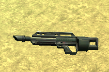

# Far Cry: Introduction to Data Science – Google Sheets


## Introduction

[Far Cry is a first-person shooter (FPS) video game](https://www.youtube.com/watch?v=Cz3vGM08S7Q&has_verified=1) with amazing graphics, developed by Crytek and published by Ubisoft. The game was released in 2004 for Microsoft Windows and was a huge commercial success. Ubisoft closed the online servers almost 12 years later.

Far Cry features several [multiplayer modes](https://www.youtube.com/watch?v=GaFM0uWAzh0) in which players basically score points by killing other players. One of these multiplayer modes is deathmatch, also known as free for all (FFA), where the goal is to kill (or frag, from the military term) as many other players as possible within a limited period of time. Basically, everything that moves SHOULD be killed… :)

### Multiplayer FFA Session

Players can join an online multiplayer session by connecting to a Far Cry server. A session starts for a configurable limited period of time, for example: 30 minutes, during which each player tries their best to seek out and kill other players.

When the limited period of time expires, the game stops and it displays the results of the match as an ordered leaderboard with the number of kills and deaths per player, and the efficiency of each player:


### Weapons

Players have access to a large arsenal of real-world weapons in Far Cry, from grenades and pistols, to rocket launchers, machines guns and sniper rifles. Check out [all of the weapons from good old Far Cry](https://www.youtube.com/watch?v=vzNG4VlCTFM)! They sound so cool!

| Name                                              | Code                                                  | Photo                                                  |
| ------------------------------------------------- | ----------------------------------------------------- | ------------------------------------------------------ |
| Machete                                           | `Machete`                                             |                      |
| Jungle Falcon                                     | `Falcon`                                              |                |
| Jackhammer Shotgun                                | `Shotgun`                                             |           |
| P90 SMG                                           | `P90`                                                 |                      |
| MP5 SMG                                           | `MP5`                                                 |                      |
| M4 Carbine                                        | `M4`                                                  |                   |
| AG36 Assault Rifle                                | `AG36` for the rifle, `AG36Grenade` for the explosive |           |
| OICW Advanced Assault Rifle                       | `OICW` for the rifle, `OICWGrenade` for the explosive |  |
| AW50 Sniper Rifle                                 | `SniperRifle`                                         |            |
| M249 SAW MG                                       | `M249`                                                |                  |
| Rocket Launcher                                   | `Rocket`                                              |              |
| Grenade                                           | `HandGrenade`                                         |                  |
| Mk.19 Mounted Mortar Launcher Platform            | `StickyExplosive`                                     |                       |
| Patrol Boat (when a player runs over another)     | `Boat`                                                |                 |
| Humvee or Buggy (when a player runs over another) | `Vehicle`                                             |                       |
| Rocket Launcher mounted on a vehicle              | `VehicleMountedRocketMG`                              |                      |
| Mounted Minigun                                   | `VehicleMountedAutoMG`, `MG`                          |               |
| Machine Gun mounted on a vehicle                  | `VehicleMountedMG`                                    |                       |
| Rocket Launcher mounted on a vehicle              | `VehicleRocket`                                       |                      |

_Note: AG36 Assault Rifle and OICW Advanced Assault Rifle weapons have two fire modes: automatic rifle and grenade launcher._

### Server Log: Frag History

The Far Cry server stores [log information in a text file](logs/log00.txt), starting with engine and system initialization data, followed by all the frags that occurred in every match sessions.

For example:

```bash
$ cat ./logs/log00.txt | grep killed | head
<26:32> <Lua> papazark killed lamonthe with AG36
<27:07> <Lua> theprophete killed lamonthe with Rocket
<27:18> <Lua> theprophete killed lamonthe with Rocket
<27:29> <Lua> theprophete killed lamonthe with Rocket
<27:47> <Lua> theprophete killed lamonthe with Rocket
<28:10> <Lua> theprophete killed papazark with Rocket
<28:49> <Lua> theprophete killed papazark with Rocket
<29:28> <Lua> papazark killed lamonthe with AG36
<29:36> <Lua> papazark killed lamonthe with AG36
<30:07> <Lua> theprophete killed papazark with SniperRifle
```

The format of a line corresponding to a frag, when a player kills another player, is:

```text
<MM:SS:> <Lua> killer_username killed victim_username with weapon_code
```

or the following format, when a player kills himself, e.g., when a stupid player miserably dies by throwing a grenade that eventually explodes at their feet...

```text
<MM:SS:> <Lua> killer_username killed itself
```

where:

- `MM`: Zero-padded minute between 00 and 59 of the time when the frag occurred;
- `SS`: Zero-padded second between 00 and 59 of the time when the frag occurred;
- `killer_username`: Username of the player who fragged another; can only contain letters, numbers, dashes ("`-`"), periods ("`.`"), and underscores (`_`);
- `victim_username`: Username of the player who has been fragged;
- `weapon_code`: Code name of the weapon that was used to frag the other player.

_Note: The time of a frag is relative to the time the Far Cry engine started. It represents the number of minutes/seconds elapsed between the moment the game engine started and when the frags occurred._

_Note: Players who joined a match but who hid during all the match, meaning they didn't kill anyone and they haven't been killed by anyone, don't appear in the frag history at all. We just ignore them._

You can download [Far Cry 1.34 on Windows](https://drive.google.com/file/d/1pQ5RFuQ3t669KXd_jV-2KoOONdT6NcY8/view?usp=sharing), [unzip](https://www.7-zip.org/) the archive on the disk of your computer, and run the executable `./Bin32/FarCry.exe`.


## Waypoint 1: Import CSV File into Google Sheets

We will use [Google Sheets](https://www.google.com/sheets/about/) to calculate statistics about player efficiency rating (PER), which is a calculation based on the kills/deaths ratio.

You need to create a Google Sheets document named "_Intek Institute – Far Cry – Frag History_".

_Note: If you have no idea how to create a Google spreadsheet, well... just **google** it: "[how to create a google spreadsheet](https://www.google.com.vn/search?q=how+to+create+a+google+spreadsheet)"!_

Import the CSV file (of Far Cry frags that you generated) into your Google Sheets document.

For example:


At this stage, you should definitely watch a few [online tutorials](https://www.youtube.com/watch?v=wQfApf3eci8&list=PLv9Pf9aNgemt61gjKQaYZHjvZlVp4OANq) about Google Sheets to understand the basic principles of rows, columns, cells, [relative and absolute cell references](https://edu.gcfglobal.org/en/googlespreadsheets/types-of-cell-references/1/), formulas, etc. You will find a lot of online resources and, indeed, the [Google Sheets Help Center](https://support.google.com/docs/topic/9054603?ref_topic=1382883) from Google itself!

## Waypoint 2: Collect the List of Players

We want to determine the list of distinct players who participated in the game session.

First, we need to collect player names from each frag, remove any duplicate names (only keeping a list of distinct player names), and sort this list in alphabetical order:


Write a formula that places the distinct name of players (in alphabetical order) in column `F` starting with cell `F1`.

You can do this with a subtle combination of [arrays](https://support.google.com/docs/answer/6208276) (using the bracket `{}` notation with semicolon) and the function [`UNIQUE`](https://support.google.com/docs/answer/3093198).

**Warning: Some dummies participating in a match may not have killed anyone; they have just been beaten to death by other players.**

_Hint: When you begin experimenting with Google Sheets array, you may face some issues, especially if you try to provide the most generic expression possible:_


_In such cases, you might want to use the function [`FILTER`](https://support.google.com/docs/answer/3093197) in coordination with the function [`ISBLANK`](https://support.google.com/docs/answer/3093290). Up to you! ;)_

## Waypoint 3: Calculate Match Statistics

We want to calculate the following match statistics:

- Number of times a player killed another;
- Number of times a player was killed by another;
- Number of times a player killed himself (what were you thinking?);
- Player efficiency.


Using the Google Sheet functions [`IF`](https://support.google.com/docs/answer/3093364), [`ISBLANK`](https://support.google.com/docs/answer/3093290), and [`COUNTIF`](https://support.google.com/docs/answer/3093480), [`COUNTIFS`](https://support.google.com/docs/answer/3256550):

1. Write a formula in column `G`'s cells to calculate the number of times the player (defined in the corresponding column `F`'s cell of the same row) killed another.

1. Write a formula in column `H`'s cells to calculate the number of times the player has been killed by another.

1. Write a formula in column `I`'s cells to calculate the number of times the player committed suicide.

1. Write a formula in column `J`'s cells to calculate the player's efficiency that uses the simple formula `kills / (kills + deaths + suicides)`.

## Waypoint 4: Split Frag History and Match Statistics into 2 Sheets

The problem with our current sheet is that it combines both frag history and match statistics.

When we want to import the frag history of another match, we need to replace the current sheet with the data of the CSV file we are importing:


We cannot use the option _Replace data at selected cell_, choosing the cell of the first column/row of our sheet, because this option keeps data (of a previous imported CSV file) that is longer than the CSV file we are importing. We need to replace all the data of the previous imported frag history.

However, by using the option _Replace current sheet_, we erase the formula that collects and sorts the player names and the formulas that calculate match statistics.

We need to create another sheet in our Google Sheets document and recreate these formulas there.

1. Rename the current sheet to `Frag History`;

1. Create a new sheet and name it `Match Statistics`;

1. In the first rows of the sheet `Match Statistics`, enter the following content in their respective columns: `Player Name`, `Kills`, `Deaths`, `Suicides`, `Efficiency`;

1. Change the font size of this first row to `12`; change the background color to a dark blue; change the foreground color to white;

1. [Freeze this first row](https://www.youtube.com/watch?v=gaEr_Hwdhuo) to pin the name of the columns and always be able to see this first row while we scroll;

1. In the sheet `Match Statistics`, delete columns after `E` as they are useless;

1. In the sheet `Match Statistics`, starting with the 2nd row, write in column `A` the formula that collects the distinct player names and sorts them in alphabetical order. You will need [to reference the sheet](https://support.google.com/docs/answer/75943) `Frag History`;

1. Write the formulas in the other columns to calculate the match statistics. For most of these formulas, you will also need to reference the sheet `Frag History`;

_Note: We consider that there is a maximum of 16 players who can join a match or the game would start lagging._


You can now import another Far Cry frag history CSV file into the sheet `Frag History`. The match statistics defined in the sheet `Match Statistics` will be automatically updated. Great!

| Frag History                                            | Match Statistics                                            |
| ------------------------------------------------------- | ----------------------------------------------------------- |
|  |  |

We can say that the sheet `Match Statistics` is a _view_ over the sheet `Frag History`. The data of the sheet `Match Statistics` is dynamically calculated from the sheet `Frag History`'s data. We will see this with relational databases later in this mission.

## Waypoint 5: Calculate the Overall Statistics of a Match

Update the sheet `Match Statistics` to include the total number of kills, deaths and suicides for the game session that has been imported.

For example:


